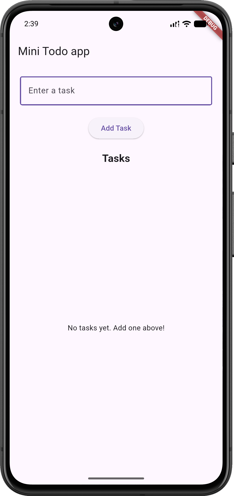
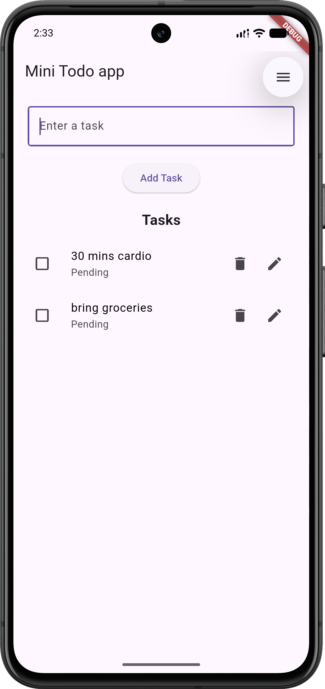
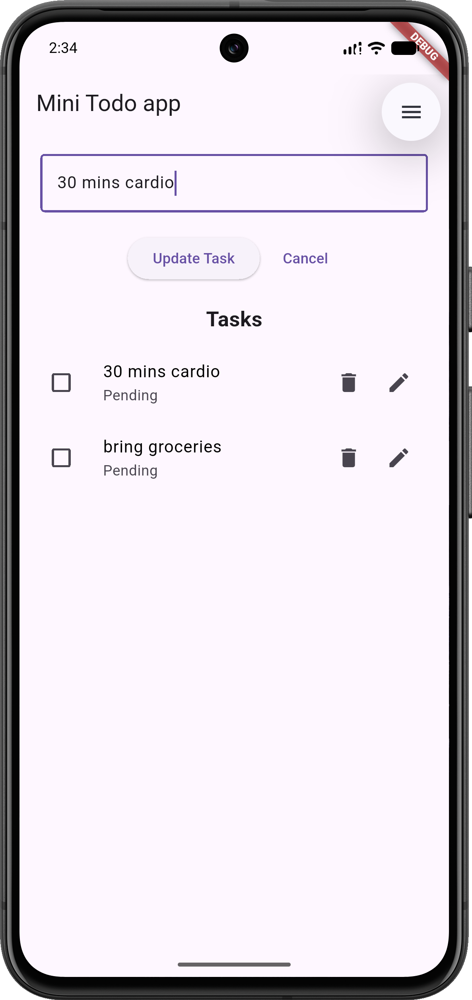

# Mini Todo App (Flutter)

A simple Todo application built with Flutter as part of my Flutter learning journey.

## Features

* Add new tasks
* Edit existing tasks
* Delete tasks
* Mark tasks as completed
* Cancel task editing
* Empty state message when no tasks are available
* Basic input validation (prevents empty tasks)

## Screenshots
 *Empty state* <br>
 *Add task* <br>
 *Edit task* <br>

<div style="display: flex; gap: 10px;">
  
  
  
</div>

---

## Concepts Learned

### Flutter Fundamentals

* StatelessWidget
* StatefulWidget
* Widget Tree
* Widget Composition
* setState()

### User Input

* TextField
* TextEditingController

### Lists & UI Rendering

* ListView.builder
* ListTile
* Conditional Rendering

### State Management

* State ownership
* Parent-child communication
* Callback functions
* VoidCallback

### Dart Concepts

* Classes and Objects
* Constructors
* Required parameters
* Lists
* Null Safety (`?`)
* Closures
* Function references

### Project Structure

* Model extraction (`Todo`)
* Widget extraction (`TodoItem`)
* Separation of concerns

---

## Project Structure

```text
lib/
├── main.dart
├── models/
│   └── todo.dart
└── widgets/
    └── todo_item.dart
```

---

## Current Version

### Version 1.0

Implemented:

* Create Todo
* Read Todos
* Update Todo
* Delete Todo
* Toggle Completion Status
* Edit Mode
* Empty State UI
* Reusable TodoItem Widget

---

## Future Improvements

- [x] Local Persistence (Shared Preferences)
- [ ] Multiple Screens
- [ ] Task Filtering
- [ ] Search Tasks
- [ ] Dark Mode
- [ ] Improved UI/UX

---

## Getting Started

```bash
git clone <repository-url>
cd mini_todo_app
flutter pub get
flutter run
```

---

## Learning Goal

This project was built to practice Flutter fundamentals, state management with `setState()`, widget composition, callbacks, and application architecture before moving to more advanced topics such as persistence, navigation, and state management solutions like Provider or Riverpod.

